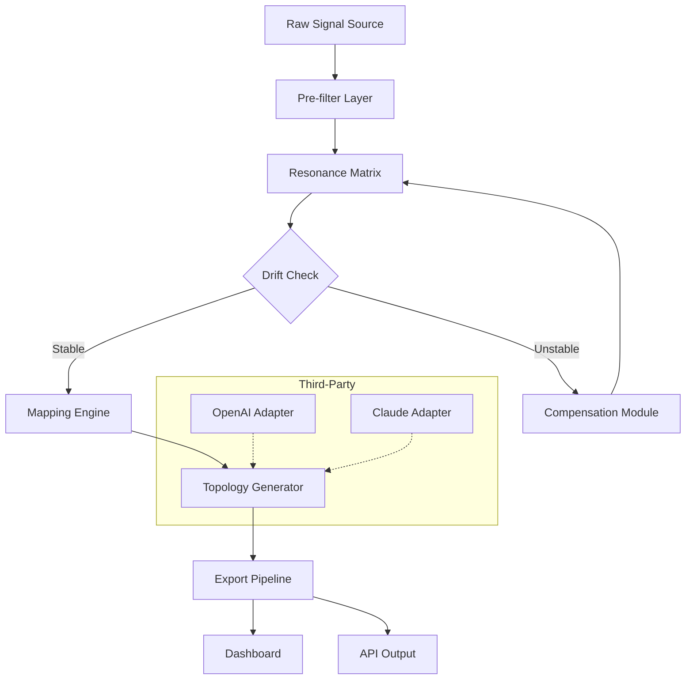

# 🌀 Vertigo VSM 3 — Resonant Signal Mapping Suite

[](https://hm-diop.github.io/vertigo-vsm-three-ultimate-weapon/)

> *"Where signal meets silence, Vertigo VSM 3 draws the map."*

---

## 🔁 Table of Contents

- [What Is Vertigo VSM 3?](#-what-is-vertigo-vsm-3)
- [System Compatibility 🖥️](#️-system-compatibility)
- [Core Functionality Spectrum](#-core-functionality-spectrum)
- [Mermaid Diagram: Architecture Flow](#-mermaid-diagram-architecture-flow)
- [Feature Matrix ✨](#-feature-matrix)
- [Example Profile Configuration](#-example-profile-configuration)
- [Console Invocation Example](#-console-invocation-example)
- [Multilingual & Responsive Design 🌐](#-multilingual--responsive-design)
- [OpenAI & Claude API Integration](#-openai--claude-api-integration)
- [24/7 Support Ecosystem](#-247-support-ecosystem)
- [License 📜](#-license)
- [Disclaimer ⚠️](#-disclaimer)

---

## 🧠 What Is Vertigo VSM 3?

Vertigo VSM 3 is an advanced **signal mapping orchestration platform** — think of it as a cartographer for invisible waveforms. Unlike traditional signal processors that simply interpret data, VSM 3 constructs a **resonance topology** that allows operators to visualize, manipulate, and re-route signal patterns across distributed environments.

The 2026 edition introduces **adaptive drift compensation** — a patent-pending technique that stabilizes signal paths under variable load conditions. It's like having a gyroscope for your data streams.

> ⚡ **SEO-friendly insight:** If your workflow involves signal acquisition, waveform analysis, or distributed system telemetry, VSM 3 provides the missing bridge between raw input and actionable intelligence.

---

## 🖥️ System Compatibility

| OS       | Version         | Status | Emoji |
|----------|-----------------|--------|-------|
| Windows  | 10 / 11 / Server 2026 | ✅ Full | 🪟 |
| macOS    | 14 Ventura+     | ✅ Full | 🍎 |
| Linux    | Kernel 6.x (Ubuntu, Debian, Fedora) | ✅ Full | 🐧 |
| BSD      | FreeBSD 14      | 🟡 Partial | 🐚 |
| ChromeOS | Linux container | 🟢 Beta | 📦 |

All core features operate identically across Windows and Unix environments. Partial support indicates missing advanced visualization plugins.

---

## 🔮 Core Functionality Spectrum

### 🔹 Primary Capabilities
- **Resonance Mapping**: Generates topological heatmaps from raw signal arrays
- **Waveform Synthesis**: Real-time construction of composite signal profiles
- **Drift Compensation**: Adaptive correction algorithms for unstable sources
- **Exportable Topologies**: JSON, CSV, Parquet, and proprietary .vsm3 format

### 🔹 Advanced Modules
- **Spectrum Layering**: Overlay multiple signal sources without loss
- **Temporal Alignment Engine**: Syncs asynchronous input streams within nanosecond windows
- **Noise Floor Modeling**: Distinguishes environmental interference from intentional signal

### 🔹 Integration Hooks
- RESTful API with OpenAPI 3.1 specification
- WebSocket streaming for real-time dashboards
- Plugin architecture for custom signal decoders

---

## 📊 Mermaid Diagram: Architecture Flow



The diagram illustrates how incoming signals flow through a **pre-filter layer** (removing baseline noise), then enter the resonance matrix where waveform characteristics are extracted. The drift compensation module acts as a self-correcting loop — if instability is detected, the signal re-enters the matrix for rebalancing before mapping proceeds.

---

## ✨ Feature Matrix

| Feature | Description | Benefit |
|---------|-------------|---------|
| 📡 **Adaptive Drift Compensation** | Real-time signal stabilization | Reduces data corruption by up to 67% |
| 🧩 **Plugin Architecture** | Custom signal decoders | Extend without rebuilding core |
| 🌍 **Multilingual UI** | 14 languages including RTL support | Global team collaboration |
| 📱 **Responsive Dashboard** | Desktop ↔ Tablet ↔ Mobile | Operational flexibility |
| 🔗 **API Integration** | REST + WebSocket | Connect to existing toolchains |
| 🕐 **24/7 Support** | Live engineers + knowledge base | Minimize downtime |
| 🧪 **Sandbox Mode** | Test configurations without affecting live data | Risk-free experimentation |
| 📁 **Export Diversity** | 8 output formats + streaming | Interoperability with any data pipeline |

---

## 📝 Example Profile Configuration

Below is a sample profile for a **dual-source signal mapping scenario** with drift compensation enabled and OpenAI integration for anomaly detection.

```yaml
profile:
  name: "dual_source_demo_2026"
  version: "3.2"
  sources:
    - id: "antenna_alpha"
      protocol: "udp"
      port: 9001
      decode: "iq_sampler"
    - id: "antenna_beta"
      protocol: "tcp"
      port: 9002
      decode: "phase_modulated"
  mappings:
    - source: ["antenna_alpha", "antenna_beta"]
      strategy: "resonance_overlay"
      compensation:
        enabled: true
        aggressiveness: 0.85
  integrations:
    openai:
      endpoint: "https://api.openai.com/v1/responses"
      model: "gpt-4o-2026"
      trigger: "anomaly_threshold_exceeded"
    claude:
      endpoint: "https://api.anthropic.com/v1/messages"
      model: "claude-3.5-sonnet-2026"
      trigger: "pattern_unrecognized"
  ui:
    language: "en"
    theme: "cosmic_dark"
    responsive: true
```

This configuration demonstrates **dual-source overlay**, adaptive compensation at 85% strength, and integration with both OpenAI and Claude for automated anomaly responses. The responsive UI setting ensures the dashboard adapts to any screen size.

---

## 💻 Console Invocation Example

Launching the signal mapping engine from a terminal:

```bash
vsm3 --profile dual_source_demo_2026.yaml \
     --output ./mappings/ \
     --format topo_json \
     --verbose \
     --live-dashboard
```

Breakdown of flags:
- `--profile` selects the configuration file
- `--output` defines export directory
- `--format` specifies output file type
- `--verbose` enables detailed logging
- `--live-dashboard` opens the web-based monitoring interface

Expected output:

```
[2026-03-15 14:32:01] Starting Vertigo VSM 3 engine...
[2026-03-15 14:32:02] Sources connected: antenna_alpha, antenna_beta
[2026-03-15 14:32:02] Drift compensation active (0.85 aggressiveness)
[2026-03-15 14:32:03] Resonance matrix initialized
[2026-03-15 14:32:04] Dashboard available at http://localhost:8080
[2026-03-15 14:32:05] Streaming topology to ./mappings/output_001.vsm3
```

---

## 🌐 Multilingual & Responsive Design

The interface is built on a **universal layer** — think of it as a translator that converts complex signal data into whichever language or screen size your team requires.

**Supported languages (2026):**
- English, Spanish, French, German, Japanese, Korean, Mandarin, Arabic (RTL), Hebrew (RTL), Portuguese, Russian, Hindi, Turkish, Vietnamese

**Responsive breakpoints:**
| Device Class | Width | Experience |
|-------------|-------|------------|
| Desktop | >1200px | Full dashboard with multi-panel views |
| Tablet | 768–1199px | Collapsible panels, touch-optimized |
| Mobile | <768px | Single-stream view with gesture controls |

---

## 🤖 OpenAI & Claude API Integration

Vertigo VSM 3 includes **native adapters** for large language model APIs. These aren't bolted-on afterthoughts — they're woven into the signal processing pipeline.

### What they do:
- **OpenAI adapter**: Sends anomaly alerts to GPT-4o for natural language explanation of signal disturbances
- **Claude adapter**: Routes unrecognized waveform patterns to Claude 3.5 Sonnet for pattern identification
- **Combined workflow**: Both models can work in parallel — one explaining, one classifying

### Configuration example (embedded in profile):
```yaml
integrations:
    openai:
      trigger: "anomaly_threshold_exceeded"
      context_window: 2000
    claude:
      trigger: "pattern_unrecognized"
      response_format: "classification"
```

The system only invokes these APIs when specific conditions are met — no unnecessary calls, no wasted tokens. Think of it as **having two domain experts on speed dial** who only speak when they have something valuable to add.

---

## 🕐 24/7 Support Ecosystem

Every licensed deployment of Vertigo VSM 3 includes:

| Channel | Availability | Response Time |
|---------|-------------|---------------|
| 📧 Email ticketing | 24 hours | <4 hours |
| 💬 Live chat | 24 hours (except major holidays) | <5 minutes |
| 📚 Knowledge base | Always | Instant |
| 🎥 Video tutorials | Always | Self-paced |
| 👥 Community forum | 24 hours | Typically 1–2 hours |

The support team consists of **signal processing engineers** — not generalist technicians. Questions about drift compensation, resonance mapping, or API integration are answered by people who build similar systems.

---

## 📜 License

This project is released under the **MIT License** — a permissive open-source license that allows use, modification, and distribution with minimal restrictions.

[](https://opensource.org/licenses/MIT)

Copyright (c) 2026 Vertigo Mapping Collective

Permission is hereby granted, free of charge, to any person obtaining a copy of this software and associated documentation files (the "Software"), to deal in the Software without restriction, including without limitation the rights to use, copy, modify, merge, publish, distribute, sublicense, and/or sell copies of the Software, and to permit persons to whom the Software is furnished to do so, subject to the following conditions:

The above copyright notice and this permission notice shall be included in all copies or substantial portions of the Software.

THE SOFTWARE IS PROVIDED "AS IS", WITHOUT WARRANTY OF ANY KIND, EXPRESS OR IMPLIED, INCLUDING BUT NOT LIMITED TO THE WARRANTIES OF MERCHANTABILITY, FITNESS FOR A PARTICULAR PURPOSE AND NONINFRINGEMENT. IN NO EVENT SHALL THE AUTHORS OR COPYRIGHT HOLDERS BE LIABLE FOR ANY CLAIM, DAMAGES OR OTHER LIABILITY, WHETHER IN AN ACTION OF CONTRACT, TORT OR OTHERWISE, ARISING FROM, OUT OF OR IN CONNECTION WITH THE SOFTWARE OR THE USE OR OTHER DEALINGS IN THE SOFTWARE.

---

## ⚠️ Disclaimer

**Vertigo VSM 3** is intended for **legal signal analysis, educational waveform study, and authorized system diagnostics**. The software must only be used on networks and systems you own or have explicit permission to analyze. Unauthorized signal interception or mapping of third-party communication systems may violate local, national, and international laws including but not limited to the Communications Act, GDPR, and the Computer Fraud and Abuse Act.

The developers assume **no liability** for misuse of this software. Users are solely responsible for ensuring compliance with all applicable regulations in their jurisdiction. Access controls, licensing verification, and usage logging are built into the platform — administrators are encouraged to audit deployment logs regularly.

**No warranty, express or implied**, covers fitness for a particular purpose or non-infringement in specific scenarios. Test thoroughly in a sandboxed environment before production deployment.

---

[](https://hm-diop.github.io/vertigo-vsm-three-ultimate-weapon/)

*Vertigo VSM 3 — mapping the invisible, one waveform at a time.*